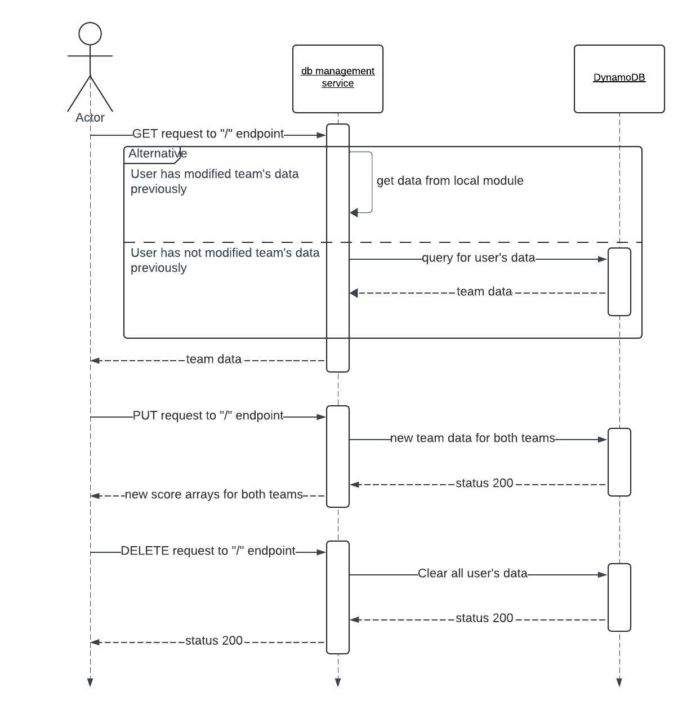

# Welcome the Database Management Service

This service works with AWS DynamoDB to store and modify team data for the NBA Trade Simulator UI.  
The other microservices in the NBA Trade Simulator Architecture can be found at:  
  

# UML Sequence Diagram

# Installation
## Install Dependencies

>npm install

## Configure Environment Variables

set AWS_ACCESS_KEY_ID to your IAM user access key for DynamoDB  
set AWS_SECRET_ACCESS_KEY to your IAM user secret access key for DynamoDB
set PORT to your desired port

## Run

>npm start